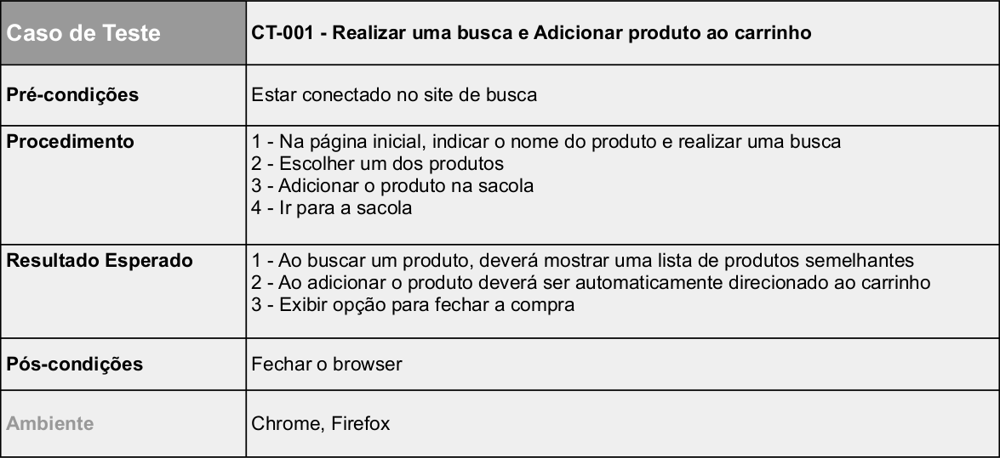

# Teste Selenium

 

- Python
- Selenium
- Pytest

  

## Projeto

# Planejamento

   

   

## Funcionalidades

- Buscar um produto
- Adicionar ao carrinho

 

## Manual de Uso
 

### Instalação

- `Instalar PyCharm CE`
- `Rodar o projeto`
 

 

### Exemplo

- Projeto funcionando (clicke para visualizar):
- [Youtube](https://youtu.be/rDfcADWKhGQ)